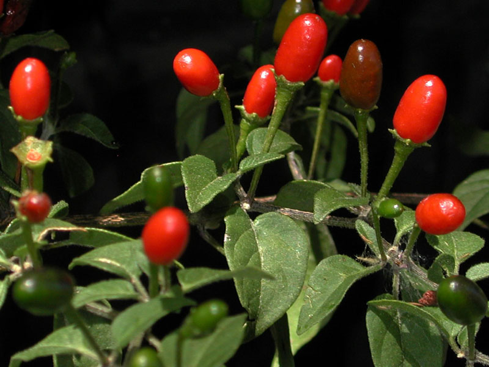
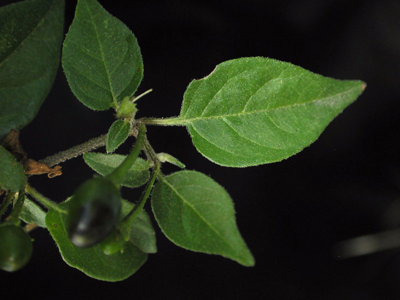

```{r setup, include=FALSE}
knitr::opts_chunk$set(echo = FALSE)
```


## Introduction

<div class="red2">
>- Crop domestication:
</div>

>- The genetical, physiological and morphological alterations of wild plant species in order to create a new individual, with economical value and novel traits, capable of fulfilling human requirements and necessities


<div class="red2">
>- Wild Progenitors:
</div>

>- Wild plant related to a domesticated plant and/or cultivar, whose geographic origins can be traced to center of origins. The wild progenitor of a given individual might be, or not, a completely new species.  

## Example of species domesticated in Mexico (WS = Wild Specie, CS: Cultivated Species)

-Chili 

>- <div class="red2"> (WS: Capsicum annuum var. glabriusculum, Cs: Capsicum annuum var. annuum L.) </div> 

-Squash

>- <div class="red2"> (WS: Cucurbita argyrosperma ssp. sororia, CS: Cucurbita argyrosperma ssp. argyrosperma) </div> 

- Tomatillo

>- <div class="red2"> (WS: Physalis philadelphica, CS: Physalis philadelphica) </div>

## Chili Wild Progenitor's Fruit


<p style="text-align:center;"></p>

## Comparison between wild and cultivar fruits

<p style="text-align:center;"></p>
Fig.1: Illustration of wild fruits from chili's wild progenitor (left) and multiple domesticated varieties (right) 

## Leafs Morphology

<p style="text-align:center;"></p>


